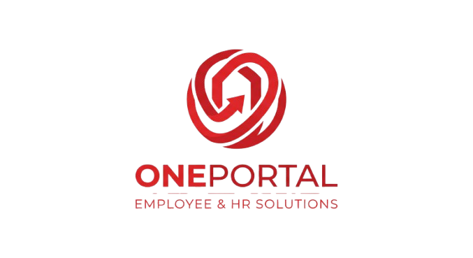

<table>
<tr>
<td width="60%">

# OnePortal

A modern internal employee management portal built with Laravel and Blade, designed to simplify employee administration, leave management, workforce visibility, and internal operations. Administration is handled through a separate Filament-powered **Control Panel**, kept fully independent from the employee-facing portal.

### Features

- Employee Dashboard
- Leave Management
- Employee Directory
- Workforce Visibility
- Filament Control Panel (Users, Departments, Attendance, Leave Requests)
- Profile Management

</td>

<td width="40%">



</td>
</tr>
</table>

---

## Overview

OnePortal is a centralized platform that allows employees and administrators to manage daily workforce operations through a clean and secure interface.

The application provides visibility into employee availability, leave requests, work locations, and organizational information while maintaining a simple and intuitive user experience.

Built with Laravel and Blade, the platform follows a lightweight and maintainable architecture suitable for internal company environments.

The employee-facing portal and the admin experience are fully separated: employees use the Blade portal at the root domain, while admins are routed to a dedicated **Control Panel** built with [Filament](https://filamentphp.com) at `/control-panel`. An admin account is redirected there automatically and can't fall back to the employee portal's pages.

---

## Recent Updates

### Control Panel Improvements

* Attendance and Leave Request tables in the Control Panel now group records by employee, collapsed by default — pick an employee to expand their history and edit individual records, instead of scrolling a flat list of every record.
* The language switcher moved out of the topbar and into the admin's user menu (click the avatar in the top-right).
* Removed the legacy in-portal admin dashboard, user management, and leave-approval pages (and their routes/views/controllers) now that the Control Panel fully covers that functionality, along with unused local-registration/password-reset scaffolding left over from the switch to Microsoft Entra ID.

### Light / Dark Theme

The portal now defaults to a mild white theme, with a per-user light/dark toggle in the sidebar. The preference is saved to the user's account (not just the browser) so it follows them across devices. Every page and shared component (buttons, modals, forms, tables, charts) uses a shared set of CSS custom properties (`--portal-bg`, `--portal-surface`, `--portal-border`, `--portal-primary`, `--portal-text-primary`, `--portal-text-secondary`) so both themes stay visually consistent.

### Interactive Leave Calendar

Both the Dashboard and the Leave Requests page now show a real calendar for the current month, with:

* **Click-to-request** — click a day to open the leave request form with that date pre-filled, or click a second day to pre-fill a multi-day range.
* **Status badges** — days show **ON LEAVE** (approved), **?** (pending review), or **X** (rejected), based on the user's own leave requests.
* **No duplicate requests** — a day that already has a pending, approved, or rejected request can't be selected again.
* **Month navigation** — prev/next arrows to browse past and future months.

### Leave / Attendance Integration

An employee with an approved leave request covering today is blocked from checking in or out, and the dashboard shows an "on approved leave today" message instead of the check-in button.

### Other fixes

* Confirmation modals (delete user, delete account, etc.) are now centered on screen with correct contrast in dark mode.
* Chart.js graphs on the Statistics page now render correctly in dark mode (axis labels, gridlines, and legend were previously invisible).
* Rebranded to **OnePortal**, including new logo and favicon assets.

---

## Key Features

### Employee Dashboard

Employees have access to a personalized dashboard containing important information at a glance.

Features include:

* Current leave balance
* Total leave days used
* Pending leave requests
* Department information
* Employment information
* Quick navigation to portal services


---

### Employee Directory

The employee directory provides a complete overview of the organization's workforce.

Employees can:

* View all employees
* Search employees
* Filter by department
* View work status
* View work location

Information displayed includes:

* Employee name
* Department
* Work mode
* Availability status


---

### Leave Management

The portal includes a complete leave request workflow.

Employees can:

* Submit leave requests
* Select leave dates
* Choose department
* Provide leave reason
* View leave history
* Track approval status

Leave request statuses:

* Pending
* Approved
* Rejected


---

### Workforce Visibility

Employees can quickly see who is available throughout the organization.

Workforce statuses include:

* Remote
* On Site
* On Leave

This helps teams coordinate more efficiently and improves organizational visibility.

## Workforce Visibility Preview 


---

### User Profile Management

Every employee has access to a personal profile section.

Users can:

* Update profile information
* Manage personal details
* Maintain account information

## User Profile Management Preview


---

## Administrative Features

The portal uses a simple role system.

### Roles

#### User

Standard employee access to the portal.

Permissions:

* View dashboard
* Submit leave requests
* View leave history
* Access employee directory
* Manage profile settings

---

#### Admin

Full administrative access, exclusively through the Filament **Control Panel** (`/control-panel`) — an admin account is redirected there and can't use the employee portal's pages.

The Control Panel provides:

* **Users** — manage accounts, roles, departments, and passwords (including forcing a password change on next login)
* **Departments** — create, edit, and delete departments
* **Attendance** — records grouped by employee, expandable to view and edit individual check-ins/check-outs
* **Leave Requests** — records grouped by employee; approve or reject pending requests with an optional audit note
* **Dashboard widgets** — workforce overview at a glance

---

## Dashboard Preview


---

## Employee Directory Preview


---

## Leave Requests Preview


---

## Control Panel Preview


---

## Technology Stack

### Backend

* Laravel
* PHP
* SQLite (Development)
* Laravel Herd

### Frontend

* Blade
* Tailwind CSS

### Admin Control Panel

* [Filament](https://filamentphp.com)

### Authentication

* Microsoft Entra ID (SSO) — primary sign-in method for employee accounts
* Local email/password login as a fallback; self-registration and self-service password reset are disabled in favor of Entra ID (an admin can force a password change from the Control Panel)

## Login Page


### Charts & Analytics

* Chart.js

## Charts & Analytics Preview


---

## Project Structure

```text
app/
├── Models
├── Http
│   └── Controllers
├── Filament
│   ├── Resources     # Control Panel: Users, Departments, Attendance, Leave Requests
│   ├── Pages
│   └── Widgets
├── Providers
│   └── Filament      # Control Panel configuration
├── Services

resources/
├── views
│   ├── dashboard
│   ├── employees
│   ├── leaves
│   └── profile

database/
├── migrations
├── factories
└── seeders
```

---

## Installation

### Clone Repository

```bash
git clone https://github.com/yourusername/OnePortal.git

cd OnePortal
```

### Install Dependencies

```bash
composer install

npm install
```

### Environment Configuration

```bash
cp .env.example .env
```

Generate the application key:

```bash
php artisan key:generate
```

### Configure Database

Create an SQLite database file:

```bash
touch database/database.sqlite
```

Update your `.env` file:

```env
DB_CONNECTION=sqlite
DB_DATABASE=database/database.sqlite
```

### Run Migrations

```bash
php artisan migrate
```

### Build Frontend Assets

```bash
npm run build
```

### Running the Application

#### Option 1: Laravel Herd (Recommended)

This project was primarily developed and tested using Laravel Herd.

If you have Herd installed:

1. Add the project to Herd.
2. Secure the site if needed.
3. Open the generated local URL from the Herd dashboard.

Example:

```text
https://portalproject.test
```

#### Option 2: Laravel Development Server

Run:

```bash
php artisan serve
```

The application will be available at:

```text
http://localhost:8000
```


## While any standard Laravel environment is supported, Laravel Herd is the recommended setup for local development.


## Future Enhancements

Planned features include:
 
* Email Notifications
* Leave Reports
* Department Statistics
* Export Functionality
* Audit Logs

---

## Security

Sensitive information such as credentials, API keys, and secrets are never stored in the repository.

Environment-specific configuration is managed through `.env` files.

---

## License

© 2026 OnePortal. All rights reserved.

This repository contains proprietary software developed for OnePortal's internal use.

The contents of this repository, including source code, documentation, and assets, are confidential and may not be reproduced, distributed, modified, or disclosed without prior written permission from OnePortal.

